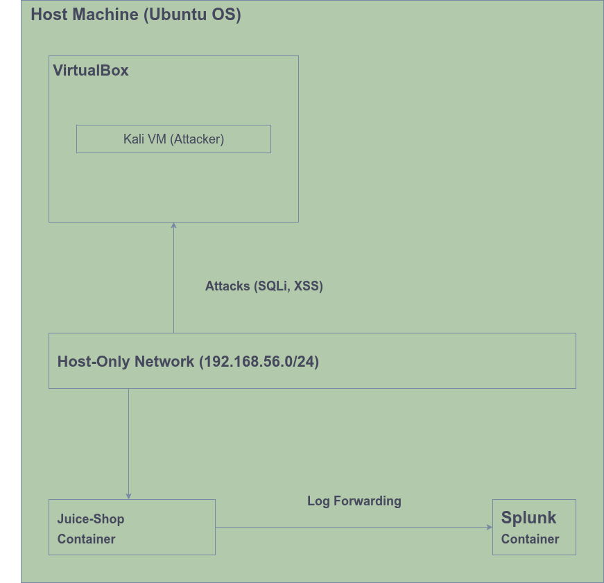

# Full Capstone Project Report: Building a Secure Cloud & Pentesting Lab

**Author**: Reza Aramjou
**Date**: September 3, 2025

---

## 1. Introduction & Project Goal

The objective of this 30-day project was to demonstrate a comprehensive, hands-on understanding of modern cybersecurity and DevOps practices. This was accomplished by building a complete, end-to-end lab environment that encompassed Infrastructure as Code (IaC), CI/CD automation, offensive penetration testing of a web application, and defensive monitoring with a SIEM.

This document provides a detailed overview of the project's architecture, a threat model of the environment, a summary of implemented mitigations, and a full guide to reproducing the lab.

---

## 2. Detailed Architecture

The lab is comprised of a host machine and a single "attacker" virtual machine, simulating an external threat actor and an internal "server" environment.

* **Host Machine (Ubuntu)**: Acts as the server environment. It runs Docker to host two key containerized services:
    * **OWASP Juice Shop**: A deliberately insecure web application used as the penetration testing target.
    * **Splunk Enterprise**: A Security Information and Event Management (SIEM) platform used for log collection and analysis.
* **Kali Linux VM**: Acts as the attacker machine. It is connected to the host via a VirtualBox Host-Only network, providing network access for scanning and exploitation while remaining isolated from the internet.
* **Networking**: A private `192.168.56.0/24` network facilitates communication between the attacker VM and the host services.

This architecture provides a safe and realistic sandbox for performing penetration tests and monitoring the resulting network and application log data.



---

## 3. How to Reproduce the Lab

The following steps outline how to set up and run the entire lab environment from scratch.

### Prerequisites
* Git
* VirtualBox
* Docker & Docker Compose

### Step 1: Clone All Repositories
Clone all the necessary project repositories to your local machine.
```bash
git clone [https://github.com/RezaAramjou/portfolio.git](https://github.com/RezaAramjou/portfolio.git)
git clone [https://github.com/RezaAramjou/labs.git](https://github.com/RezaAramjou/labs.git)
git clone [https://github.com/RezaAramjou/pentest.git](https://github.com/RezaAramjou/pentest.git)
# Add other repos as needed...
```

### Step 2: Set Up the Server Environment (Host Machine)
1.  **Install Splunk**: Follow the instructions in the `labs` repository to install Splunk.
2.  **Start Juice Shop**: Use the Docker Compose file in the `labs` repository to start the application.
    ```bash
    # From the 'labs' repo
    docker-compose -f docker/juice-shop/docker-compose.yml up -d
    ```

### Step 3: Set Up the Attacker Environment (Kali VM)
1.  Create a Kali Linux VM in VirtualBox.
2.  Configure two network adapters: one **NAT** (for internet) and one **Host-Only** (for the lab network).
3.  Clone the `pentest` repository into the Kali VM.

### Step 4: Run the Attack & Defend Scenario
1.  Follow the procedures in the `pentest` repository to perform the baseline scan and exploits.
2.  Follow the procedures in the `siem-lab` repository to forward logs from the Juice Shop container to Splunk and observe the attack traffic.

---

## 4. Threat Model

A threat model was developed for the OWASP Juice Shop application using the **STRIDE** framework to identify potential security risks.

| Threat Category | Description | Scenario for Juice Shop |
| :--- | :--- | :--- |
| **S**poofing | An attacker illegitimately assumes the identity of another user. | An attacker uses a SQL Injection vulnerability on the login page to bypass authentication and log in as the administrator. |
| **T**ampering | An attacker modifies data on the system. | After gaining admin access via SQLi, an attacker could modify product prices, delete users, or alter application data. |
| **R**epudiation | An attacker performs malicious actions in a way that cannot be traced back to them. | Insufficient logging could allow an attacker to deface the site or steal data without leaving a clear audit trail of their specific actions. |
| **I**nformation Disclosure | An attacker gains access to sensitive or private information. | The SQLi vulnerability allows an attacker to access all data in the database, including user emails, passwords, and personal information. |
| **D**enial of Service | An attacker makes a system or service unavailable to legitimate users. | An attacker could potentially find a vulnerability (e.g., a ReDoS or resource exhaustion flaw) that crashes the application server, making the shop unavailable. |
| **E**levation of Privilege | An attacker with limited user access gains higher-level (e.g., admin) permissions. | This is the primary result of the SQLi vulnerability, where an anonymous user elevates their privileges to that of a full administrator. |

---

## 5. Mitigation Plan & Implemented Fixes

Based on the threat model and the penetration test findings, the following mitigations were implemented and verified.

### 5.1. SQL Injection (Spoofing, Tampering, Information Disclosure, Elevation of Privilege)

* **Threat**: An attacker can bypass the login page to gain administrator access.
* **Implemented Fix**: The vulnerable login function was replaced with a secure mock endpoint that performs strict string comparisons instead of building a raw SQL query. In a real-world scenario, this would be implemented using **parameterized queries**.
* **Evidence**:
    * **Commit with Fix**: [fix: harden demo app against XSS/SQLi](https://github.com/RezaAramjou/docker-app/commit/87b8b229cd235b3a30e05cca93fba66a0d62ca83)
    * **Verification**: The fix was verified by re-testing the original SQLi payload, which was successfully rejected. This is documented in the [Penetration Test Report](https://github.com/RezaAramjou/pentest/blob/main/reports/juice-shop-report.md).

### 5.2. Cross-Site Scripting (XSS) (Spoofing, Tampering)

* **Threat**: An attacker can inject malicious scripts into the application, which then execute in the browsers of other users, potentially leading to session hijacking.
* **Implemented Fix**: Input sanitization was implemented using the `bleach` library to strip dangerous HTML from user input. Additionally, security headers (`X-XSS-Protection`) were added to all server responses to enable browser-level XSS filtering.
* **Evidence**:
    * **Commit with Fix**: [fix: harden demo app against XSS/SQLi](https://github.com/RezaAramjou/docker-app/commit/87b8b229cd235b3a30e05cca93fba66a0d62ca83)
    * **Verification**: The fix was verified by re-submitting the original XSS payload. The script did not execute, proving the sanitization and headers are effective.

### 5.3. Insecure Network Exposure (Information Disclosure)

* **Threat**: The bastion host's SSH port was open to the entire internet (`0.0.0.0/0`), exposing it to brute-force attacks and automated scanning.
* **Implemented Fix**: The Terraform configuration for the bastion host's security group was hardened to only allow SSH access from a specific, trusted IP address.
* **Evidence**:
    * **Commit with Fix**: [fix: tighten security group rules in terraform demo](https://github.com/RezaAramjou/terraform/commit/8409f8f2b7a2ed4566ff6b3bbd5ed5c7b76cae60)
